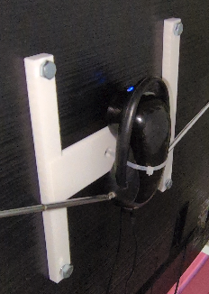
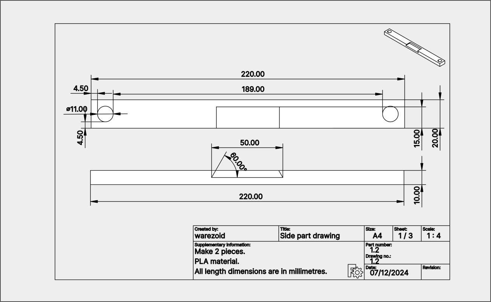
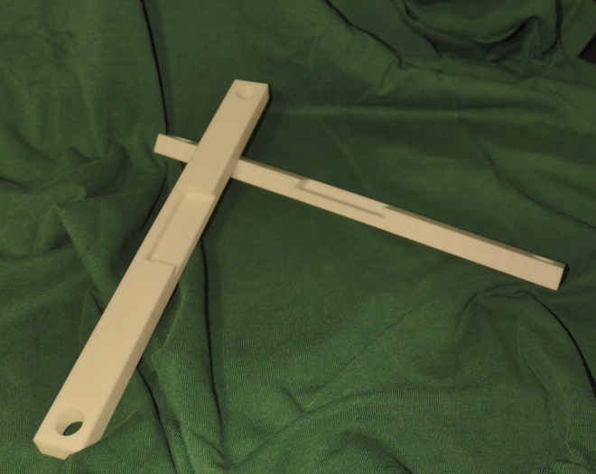
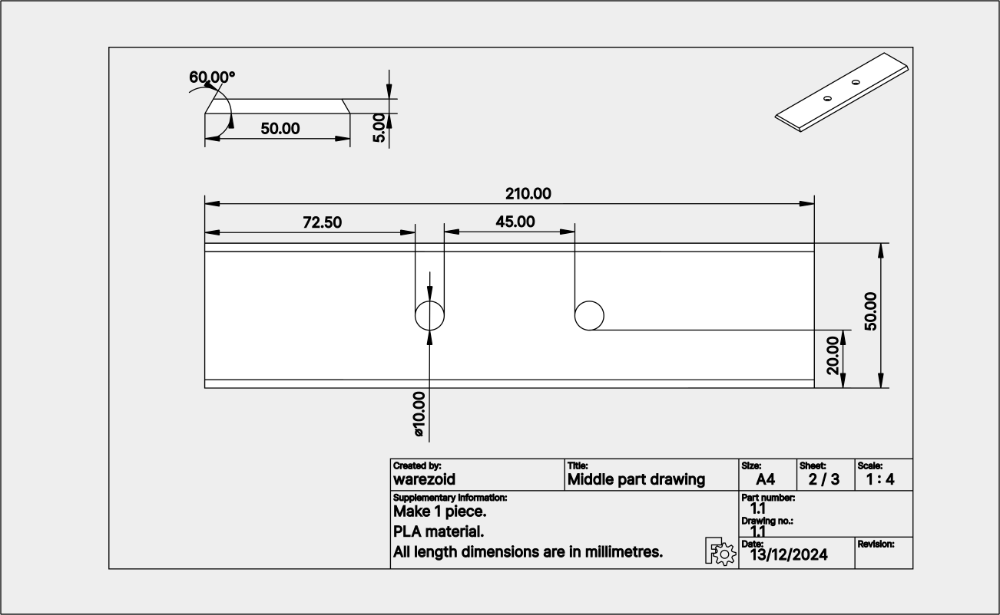
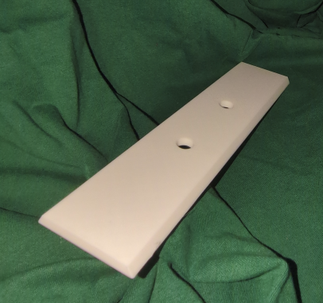

# TV antenna mount
The aim of this project is to create a structure that will allow the TV antenna to be mounted using zip ties, with the whole structure being attached to the TV via screws in VESA holes.

Below you will find photos of the final product after installation on the TV.

---

## 3D printing information
3D printing information provides a basic overview of the parameters involved in printing all parts of a particular project. The data on printing time and material consumption are based on slicer-generated data and do not correspond to actual values that would include, for example, the time required for calibration, heating and other processes. These values should therefore be considered as indicative only.

- Number of parts to print: 3 pieces

 

- 3D printer: [Creality K1 Max](https://www.creality.com/products/creality-k1-max-3d-printer)
- Slicer: [Creality Print](https://www.creality.com/pages/download-software)

 

- Filament: [Hyper Series PLA 3D Printing Filament](https://store.creality.com/products/hyper-series-pla-3d-printing-filament-1kg?variant=f5519251-fe97-4b57-9f1d-16ec93b94b97)
- Printing time: 1h 17m
- Material consumption: 21.7 m
- Infill density: 15 %

---

## Drawings and 3D modelling
The TV antenna bracket consists of two different parts which are connected by a trapezoidal groove. The parts can be glued together for additional reinforcement, but I decided to skip this step.

### Side part
The side part is used twice in the project. It is used to fix the whole bracket to the TV via VESA holes. The bracket is designed for a VESA hole spacing of 200 millimetres. At the same time, this part is connected to the middle part by a trapezoidal groove. A separate TV antenna is then attached to the middle piece.

A technical drawing of the side part is shown below.

**3D models**

 

The 3D models of the **side part** are available in FreeCAD format for possible modifications or in STL format, ready for direct 3D printing. Links can be found below:

- FreeCAD format: [side_part.FCStd](./3d/freecad/side_part.FCStd)
- STL: [side_part.stl](./3d/stl/side_part.stl)

**Final part**

 

Below is a photo of the **side part** after 3D printing. No additional adjustments were made to the printed parts after printing.

---

### Middle part
The middle part is used only once in the project. It is used to fix the TV antenna itself to the body of the bracket by means of zip ties. It also acts as a connecting element between the two side parts.

A technical drawing of the middle part is shown below.

**3D models**

 

The 3D models of the **middle part** are available in FreeCAD format for possible modifications or in STL format, ready for direct 3D printing. Links can be found below:

- FreeCAD format: [middle_part.FCStd](./3d/freecad/middle_part.FCStd)
- STL: [middle_part.stl](./3d/stl/middle_part.stl)

**Final part**

 

Below is a photo of the **middle part** after 3D printing. No additional adjustments were made to the printed parts after printing.

