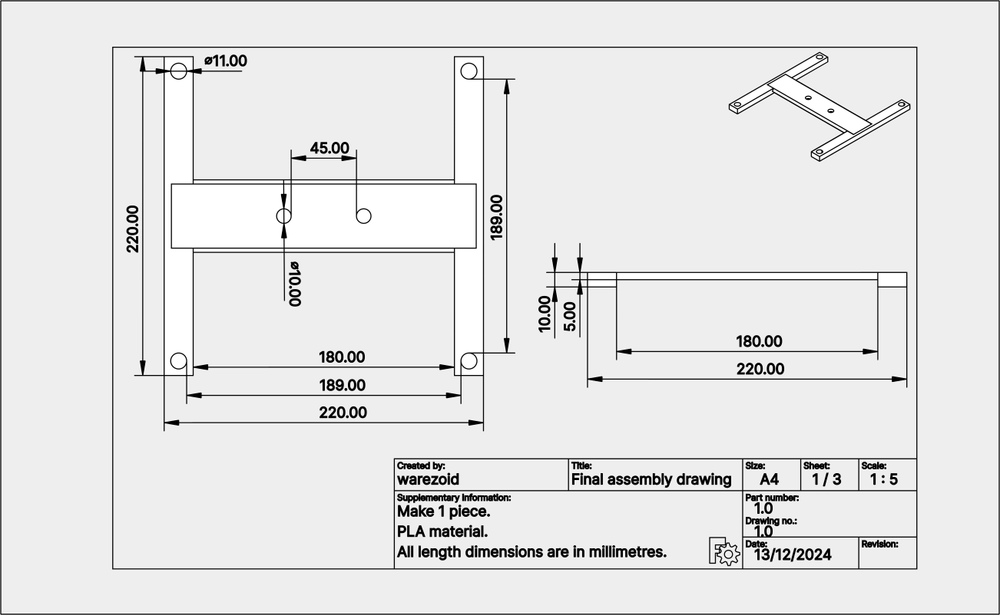
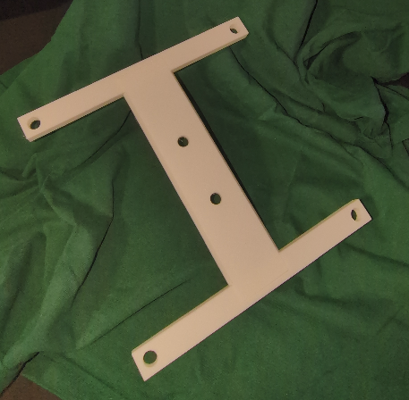

# TV antenna mount
The aim of this project is to create a structure that will allow the TV antenna to be mounted using zip ties, with the whole structure being attached to the TV via screws in VESA holes.

Below you will find photos of the final product after installation on the TV.


---


## Table of content
- [3D printing information](#3d-printing-information)
- [Material](#material)
- [Drawings and 3D modelling](#drawings-and-3d-modelling)
    - [Side part](#side-part)
    - [Middle part](#middle-part)
    - [Final assembly](#final-assembly)
- [Final installation](#final-installation)
- [License](#license)
- [Contact](#contact)

---


## 3D printing information
3D printing information provides a basic overview of the parameters involved in printing all parts of a particular project. The data on printing time and material consumption are based on slicer-generated data and do not correspond to actual values that would include, for example, the time required for calibration, heating and other processes. These values should therefore be considered as indicative only.

- Number of parts to print: 3 pieces

<br>

- 3D printer: [Creality K1 Max](https://www.creality.com/products/creality-k1-max-3d-printer)
- Slicer: [Creality Print](https://www.creality.com/pages/download-software)

<br>

- Filament: [Hyper Series PLA 3D Printing Filament](https://store.creality.com/products/hyper-series-pla-3d-printing-filament-1kg?variant=f5519251-fe97-4b57-9f1d-16ec93b94b97)
- Printing time: 1h 17m 16s
- Material consumption: 21.71 m
- Material weight: 64.74 g
- Infill density: 15 %
- Supports: no supports.

---


## Material
Below is a table of the material that was used to implement this project. However, the material needed for your particular project may vary, so I recommend that you check everything thoroughly before starting the project.

<br>

| Name | Number of pieces | Material
|-----------|-----------|-----------|
| 3D printed side part | 2 | PLA |
| 3D printed middle part | 1 | PLA |
| M8x30 screws | 2 | metal |
| M8x45 screws | 2 | metal |
| 200x3.5 zip ties | 2 | plastic |

---


## Drawings and 3D modelling
The TV antenna bracket consists of two different parts which are connected by a trapezoidal groove. The parts can be glued together for additional reinforcement, but I decided to skip this step.


### Side part
The side part is used twice in the project. It is used to fix the whole bracket to the TV via VESA holes. The bracket is designed for a VESA hole spacing of 200 millimetres. At the same time, this part is connected to the middle part by a trapezoidal groove. A separate TV antenna is then attached to the middle piece.

A technical drawing of the side part is shown below.


**3D models**

<br>

The 3D models of the **side part** are available in FreeCAD format for possible modifications or in STL format, ready for direct 3D printing. Links can be found below:

- FreeCAD format: [side_part.FCStd](./3d/freecad/side_part.FCStd)
- STL: [side_part.stl](./3d/stl/side_part.stl)


**Final part**

<br>

Below is a photo of the **side part** after 3D printing. No additional adjustments were made to the printed parts after printing.


---


### Middle part
The middle part is used only once in the project. It is used to fix the TV antenna itself to the body of the bracket by means of zip ties. It also acts as a connecting element between the two side parts.

A technical drawing of the middle part is shown below.


**3D models**

<br>

The 3D models of the **middle part** are available in FreeCAD format for possible modifications or in STL format, ready for direct 3D printing. Links can be found below:

- FreeCAD format: [middle_part.FCStd](./3d/freecad/middle_part.FCStd)
- STL: [middle_part.stl](./3d/stl/middle_part.stl)


**Final part**

<br>

Below is a photo of the **middle part** after 3D printing. No additional adjustments were made to the printed parts after printing.


---


### Final assembly
I also attach a technical drawing, 3D model and photos of the individual parts during final assembly. No special tools were needed for the assembly of the final product.




**3D models**

 <br>

The 3D models of the **final assembly** are available in FreeCAD format for possible modifications. Links can be found below:

- FreeCAD format: [final_assembly.FCStd](./3d/freecad/final_assembly.FCStd)


**Final assembly photos**

<br>

No additional adjustments were made to the printed parts after printing.



---


## Final installation
A separate TV antenna is attached to the folded bracket using zip ties. A photo of the final product is below.


The entire product is then mounted to the TV VESA holes using the screws provided. In my case it was metric M8 screws. The final product after mounting to the TV looks like this.


---


## License
The entire 3D printing repository is licensed under the MIT license. The full text of the license can be found [here](../../LICENSE.md). For more information, please visit [Wikipedia - MIT License](https://en.wikipedia.org/wiki/MIT_License).

---


## Contact
For questions, comments, or suggestions for improvements, feel free to contact me via the **Issues tab on GitHub** or the **email below**.

```
warezoid@proton.me
```

---


Created by warezoid with the love of freedom and numbers.