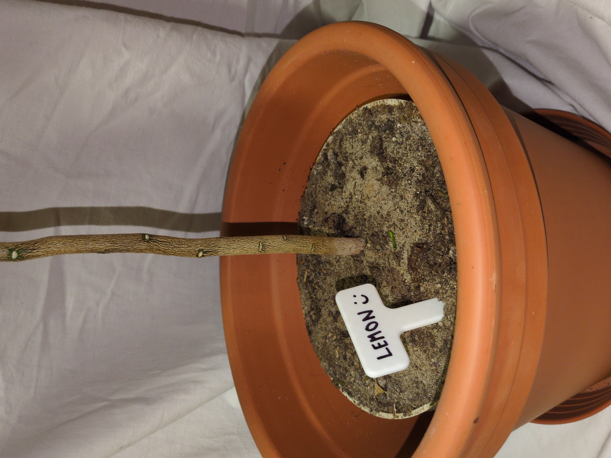
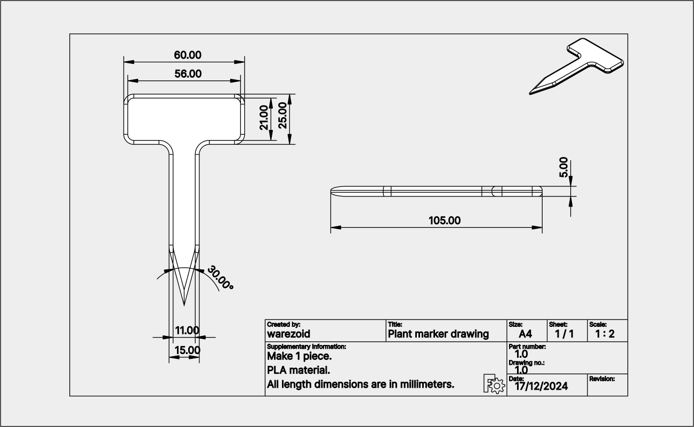
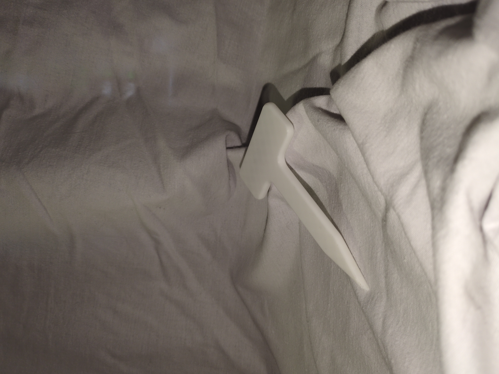
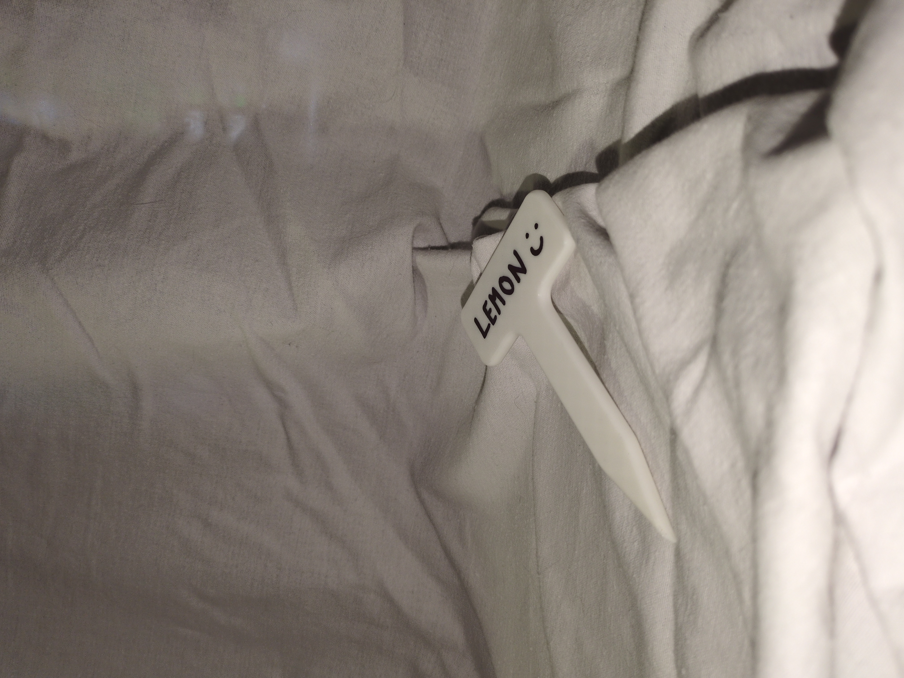
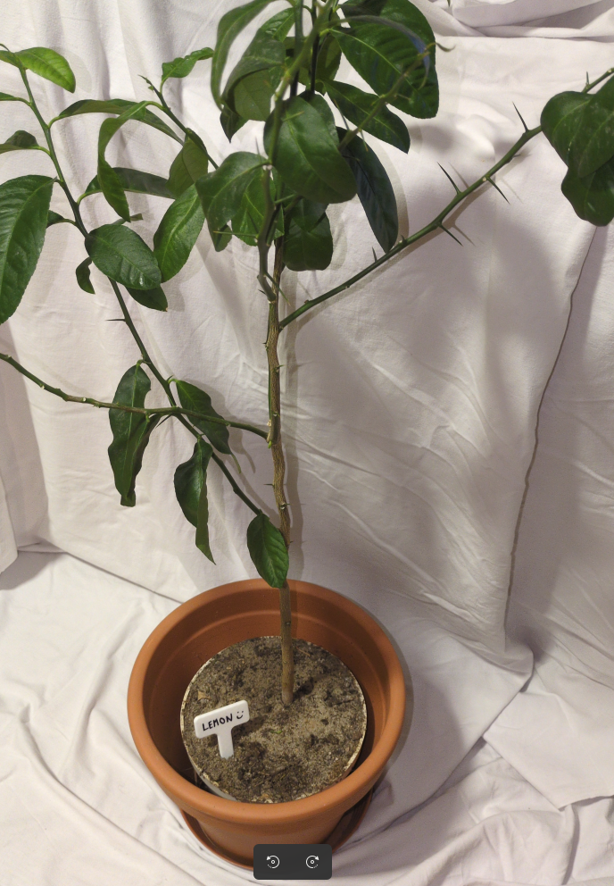

# Plant marker
The goal of this project is to create a simple plant marker.

<br>

**Warning**

The product is made of PLA plastic, which does not belong in nature. I recommend using this project with respect for the environment - ideally in your own garden or in someone else's garden with the owner's permission.

If the product runs out of life, try to reuse it or recycle it properly.

<br>



---


## Table of content
- [3D printing information](#3d-printing-information)
- [Material](#material)
- [Drawings and 3D modelling](#drawings-and-3d-modelling)
- [Final installation](#final-installation)
- [License](#license)
- [Contact](#contact)

---


## 3D printing information
3D printing information provides a basic overview of the parameters involved in printing all parts of a particular project. The data on printing time and material consumption are based on slicer-generated data and do not correspond to actual values that would include, for example, the time required for calibration, heating and other processes. These values should therefore be considered as indicative only.

- Number of parts to print: 1 piece

<br>

- 3D printer: [Creality K1 Max](https://www.creality.com/products/creality-k1-max-3d-printer)
- Slicer: [Creality Print](https://www.creality.com/pages/download-software)

<br>

- Filament: [Hyper Series PLA 3D Printing Filament](https://store.creality.com/products/hyper-series-pla-3d-printing-filament-1kg?variant=f5519251-fe97-4b57-9f1d-16ec93b94b97)
- Printing time: 9m 1s
- Material consumption: 2.36 m
- Infill density: 15 %

---


## Material
Below is a table of the material that was used to implement this project. However, the material needed for your particular project may vary, so I recommend that you check everything thoroughly before starting the project.

<br>

| Name | Number of pieces | Material
|-----------|-----------|-----------|
| 3D printed plant marker | 1 | PLA |

---


## Drawings and 3D modelling
The plant marker is made up of one part, which consists of a part for writing the name of the plant and a part for sticking into the soil.

Below you can find a technical drawing of the plant marker.




**3D models**

<br>

The 3D models of the **plant marker** are available in FreeCAD format for possible modifications or in STL format, ready for direct 3D printing. Links can be found below:

- FreeCAD format: [plant_marker.FCStd](./3d/freecad/plant_marker.FCStd)
- STL: [plant_marker.stl](./3d/stl/plant_marker.stl)


**Final part**

<br>

Below is a photo of the **plant marker** after 3D printing. No additional adjustments were made to the printed parts after printing.



---


## Final installation
For example, the name of the plant can be written on the printed piece using a marker.



Next, simply stick the marker into the soil next to the plant you want to mark. However, be careful not to damage the roots of the plant.



---


## License
The entire 3D printing repository is licensed under the MIT license. The full text of the license can be found [here](../../LICENSE.md). For more information, please visit [Wikipedia - MIT License](https://en.wikipedia.org/wiki/MIT_License).

---


## Contact
For questions, comments, or suggestions for improvements, feel free to contact me via the **Issues tab on GitHub** or the **email below**.

```
warezoid@proton.me
```

---


Created by warezoid with the love of freedom and numbers.