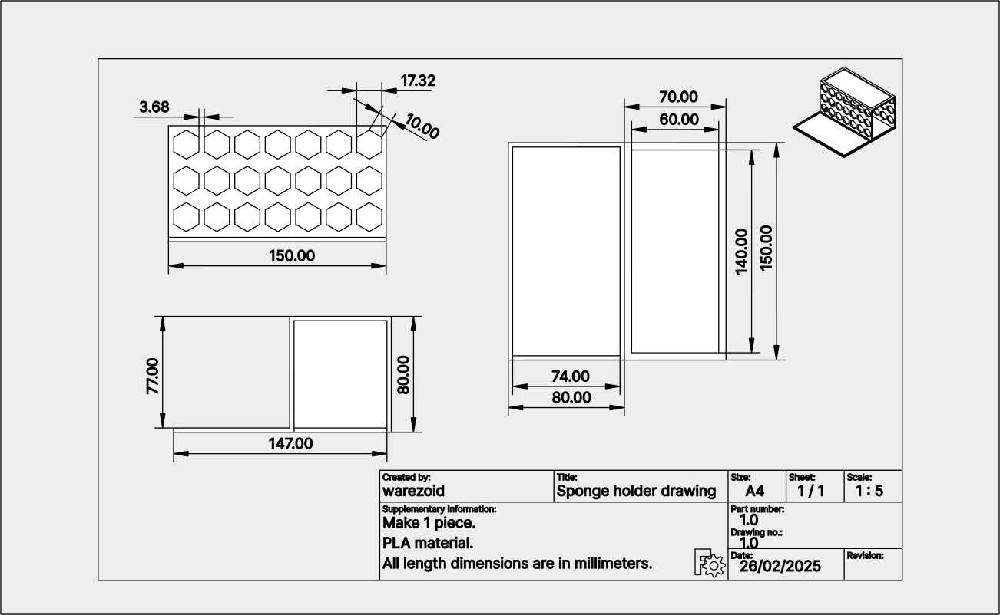

# Sponge holder
The goal of this project is to create a kitchen holder that can hold a sponge and dish detergent and liquid soap.

<br>


---


## Table of content
- [3D printing information](#3d-printing-information)
- [Material](#material)
- [Drawings and 3D modelling](#drawings-and-3d-modelling)
- [Final installation](#final-installation)
- [License](#license)
- [Contact](#contact)

---


## 3D printing information
3D printing information provides a basic overview of the parameters involved in printing all parts of a particular project. The data on printing time and material consumption are based on slicer-generated data and do not correspond to actual values that would include, for example, the time required for calibration, heating and other processes. These values should therefore be considered as indicative only.

- Number of parts to print: 1 piece

<br>

- 3D printer: [Creality K1 Max](https://www.creality.com/products/creality-k1-max-3d-printer)
- Slicer: [Creality Print](https://www.creality.com/pages/download-software)

<br>

- Filament: [Hyper Series PLA 3D Printing Filament](https://store.creality.com/products/hyper-series-pla-3d-printing-filament-1kg?variant=ac30eff6-e5c1-4d4c-a694-8ecff7ebeec8)
- Printing time: 2h 35m 23s
- Material consumption: 27.6 m
- Material weight: 82.31 g
- Infill density: 15 %
- Supports: no supports.

---


## Material
Below is a table of the material that was used to implement this project. However, the material needed for your particular project may vary, so I recommend that you check everything thoroughly before starting the project.

<br>

| Name | Number of pieces | Material
|-----------|-----------|-----------|
| 3D printed sponge holder | 1 | PLA |

---


## Drawings and 3D modelling
The sponge holder consists of two horizontal platforms placed at different heights. Each platform has a groove for catching excess water. The platforms are arranged in a stepped shape.  The walls of the step are perforated with a hexagonal grid, which ensures material saving, light weight, strength and attractive appearance. The whole structure forms one solid unit.

Below you can find a technical drawing of the sponge holder.




**3D models**

<br>

The 3D models of the **sponge holder** are available in FreeCAD format for possible modifications or in STL format, ready for direct 3D printing. Links can be found below:

- FreeCAD format: [sponge_holder.FCStd](./3d/freecad/sponge_holder.FCStd)
- STL: [sponge_holder.stl](./3d/stl/sponge_holder.stl)


**Final part**

<br>

Below is a photo of the **sponge holder** after 3D printing. No additional adjustments were made to the printed parts after printing.


---


## Final installation
...

---


## License
The entire 3D printing repository is licensed under the MIT license. The full text of the license can be found [here](../../LICENSE.md). For more information, please visit [Wikipedia - MIT License](https://en.wikipedia.org/wiki/MIT_License).

---


## Contact
For questions, comments, or suggestions for improvements, feel free to contact me via the **Issues tab on GitHub** or the **email below**.

```
warezoid@proton.me
```

---


Created by warezoid with the love of freedom and numbers.